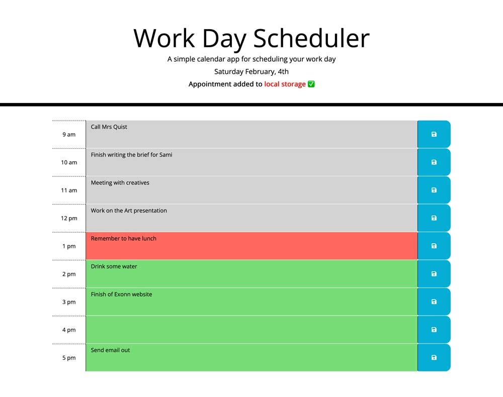

# Daily-Planner-App

A simple calendar app.

## Description

This is a simple calendar application that allows a user to save events for each hour of the day by modifying starter code. This app will run in the browser and feature dynamically updated HTML and CSS powered by jQuery.

## Installation

To access the website click [Shirley Thompson's Daily Planner App](https://shirleyama.github.io/Daily-Planner-App/), the screenshot can be found below.

## Usage

### Resources:

- [Moment.js](https://momentjs.com/) library to work with date and time. Be sure to read the documentation carefully and concentrate on using Moment.js in the browser.

- [HTML elements](https://developer.mozilla.org/en-US/docs/Web/HTML/Element)

- [Github](https://docs.github.com/en)

- [Semantic HTML](https://www.w3schools.com/html/html5_semantic_elements.asp)

- [Acceptance Criteria](https://www.altexsoft.com/blog/business/acceptance-criteria-purposes-formats-and-best-practices/)

Last but not the least and comes highly recommended

- [Frontend Web Bootcamp Course ](https://courses.bootcampspot.com/)

## License

The MIT License

## Tests

Tested in mobile and iPad viewports to see how it responds in these.

It would be great to test the website with the Mac screenreader VoiceOver to see how the website would appear to a visually impaired person, and whether it can be improved even further.

---
